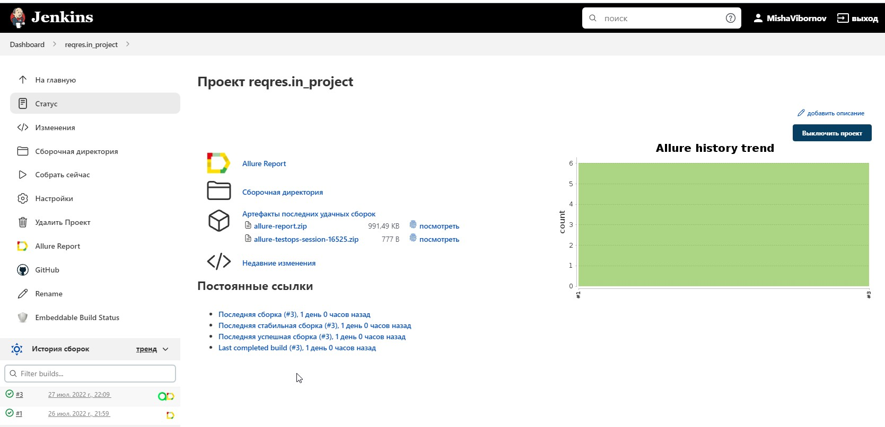
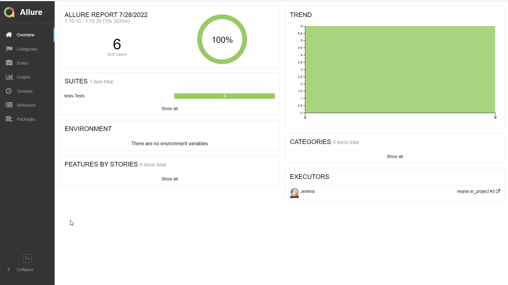
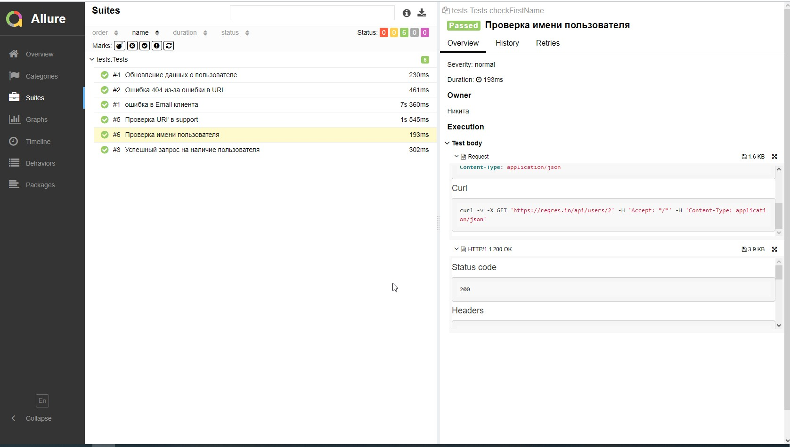
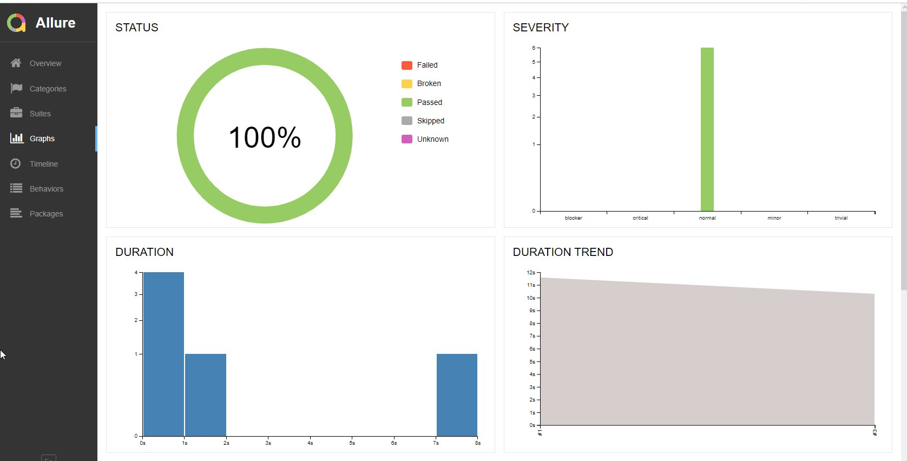
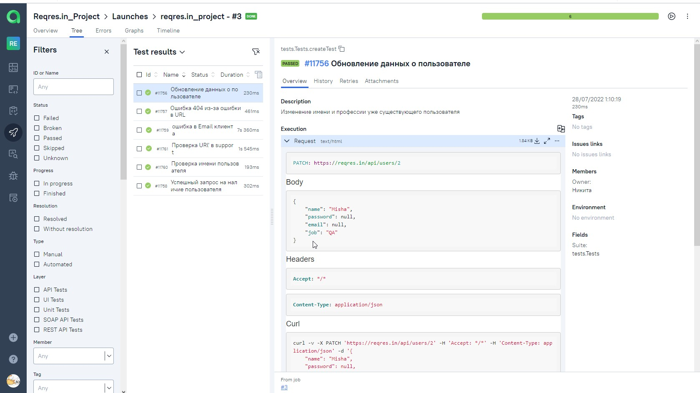
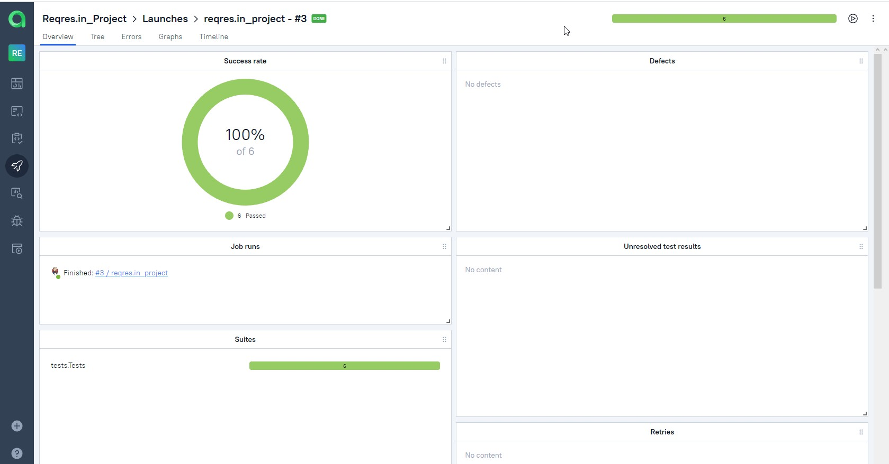

# Автоматизировация тестирования API на примере https://reqres.in/

-----

### Основные технологии на проекте

* [Java 11](https://www.oracle.com/java/) - ЯП 
* [Gradle](https://gradle.org) - сборщик проекта
* [JUnit 5](https://junit.org/junit5/) - основной фреймворк для автоматизации
* [Rest-Assured](https://rest-assured.io) -основная библиотека для тестирования АПИ 
* [Jenkins](https://www.jenkins.io/) - для обеспечения процесса непрерывной интеграции
* [Allure TestOps](https://docs.qameta.io/allure-testops/) и [Allure Report](http://allure.qatools.ru) - для управления тестами, анализа их прохождения и оформления отчетности (визуализации)
* [Lombok](https://projectlombok.org/) - библиотека для лучшей читабельности и поддержки кода
* [AssertJ](https://assertj.github.io/doc//) - библиотека для ассертов 
---

##  Запуск тестов в [Jenkins](https://jenkins.autotests.cloud/job/reqres.in_project/)

---

##  Отчет о результатах тестирования в [Allure Report](https://jenkins.autotests.cloud/job/reqres.in_project/allure/)

----

### Список тестов c описанием тестов

### Графики

###  Проект интегрирован с Allure TestOps

---

## Отображение тестов в Allure TestOps

## Дашборд

---

